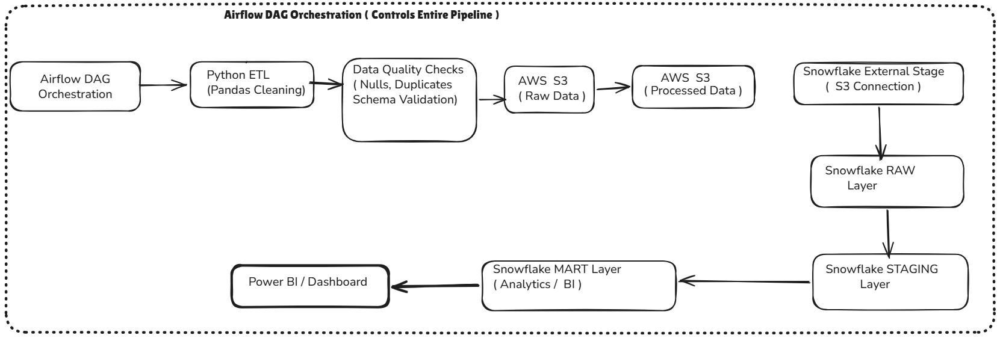

# E-Commerce Data Pipeline 🚀

An end-to-end data engineering pipeline that ingests, cleans, validates, and transforms raw e-commerce order data into a structured Snowflake warehouse for analytics and BI dashboards.

Built using AWS S3, Python (pandas), Snowflake, and Apache Airflow with production-style orchestration, data quality checks, and layered architecture.

---

## 📌 Problem Statement

Retail businesses generate large volumes of transactional data daily. However, raw data is often:
- Unstructured  
- Inconsistent  
- Filled with duplicates and null values  

This project builds a **scalable data pipeline** to automate ingestion, cleaning, transformation, and analytics-ready modeling — eliminating manual effort and enabling business insights.

---

## 🏗️ Architecture



---

## ⚙️ Tech Stack

| Layer | Tool |
|------|------|
| Orchestration | Apache Airflow (Dockerized) |
| Transformation | Python, Pandas |
| Cloud Storage | AWS S3 |
| Data Warehouse | Snowflake |
| Query Layer | SQL |
| Containerisation | Docker |

---

## 🚀 Key Features

- End-to-end automated pipeline using Airflow DAG
- Data quality validation (nulls, duplicates, schema checks)
- Layered Snowflake architecture (RAW → STAGING → MART)
- Scalable storage with AWS S3 (raw + processed layers)
- Retry & failure handling via Airflow
- Modular, production-style project structure

---

## 🔄 Pipeline Workflow

### Step 1 — Ingestion
Raw e-commerce CSV data lands in **S3 (raw layer)**.  
Airflow DAG triggers pipeline execution on schedule.

---

### Step 2 — Python ETL
Data cleaning using pandas:
- Null handling on critical fields (order_id, customer_id, revenue)
- Duplicate removal using order_id
- Data type conversions (date, numeric)
- Row count validation
- Logging for traceability

---

### Step 3 — Data Quality Checks
- Null validation  
- Duplicate detection  
- Schema validation  
- Row count checks  

Ensures only clean and reliable data flows forward.

---

### Step 4 — S3 Processed Layer
Cleaned data is stored in **S3 processed layer** using boto3.

---

### Step 5 — Snowflake Loading
- External stage connects S3 to Snowflake using IAM role
- `COPY INTO` loads data into RAW schema

---

### Step 6 — Layered Transformation

- **RAW Schema** → Exact ingested data (no changes)  
- **STAGING Schema** → Cleaned, standardized data  
- **MART Schema** → Aggregated tables for analytics  

---

### Step 7 — Orchestration (Airflow)

Airflow DAG handles:
- Task sequencing  
- Retry logic (`retries=2`)  
- Failure handling  
- Logging and monitoring  

---

## 📊 Snowflake MART Layer — Business Insights

| Mart Table | Business Insight |
|-----------|----------------|
| mart_monthly_revenue | Monthly revenue trends |
| mart_top_customers | Top customers by spend |
| mart_shipping_analysis | Delivery performance by region |
| mart_repeat_purchase | Customer retention & repeat rate |

---

## ✅ Data Quality Checks (Example)

```python
assert df['order_id'].nunique() == len(df), "Duplicate order IDs found"
assert df['revenue'].isnull().sum() == 0, "Nulls in revenue column"
assert len(df) > 0, "Empty dataframe after cleaning"

print(f"Row count validation → Before: {raw_count}, After: {clean_count}")
```

---

## 📁 Project Structure

```
ecommerce-data-pipeline/
├── dags/
│   └── ecommerce_dag.py
├── etl/
│   └── transform.py
├── sql/
│   ├── create_raw.sql
│   ├── create_staging.sql
│   └── create_marts.sql
├── quality_checks/
│   └── checks.py
├── docker-compose.yaml
├── requirements.txt
└── README.md
```

---

## ⚡ Setup Instructions

1. Clone the repository
2. Configure AWS credentials & Snowflake connection in `.env`
3. Initialize Airflow:
   ```
   docker compose up airflow-init
   ```
4. Start services:
   ```
   docker compose up -d
   ```
5. Open Airflow UI:
   ```
   http://localhost:8080
   ```
6. Trigger DAG:
   ```
   ecommerce_pipeline
   ```

---

## 🔮 Future Enhancements

- Integrate dbt for transformation and lineage
- Implement Snowpipe for real-time ingestion
- Add data observability dashboard (Streamlit / Grafana)
- Implement incremental loading using MERGE strategy
- Add Great Expectations for advanced data validation

---

## 👨‍💻 Author

**Anirban Dasgupta**  
Data Engineer  

- 🔗 LinkedIn: <your-link>
- 💻 GitHub: <your-link>
